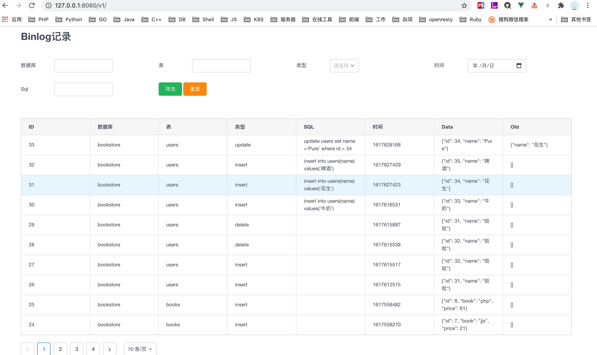

## mbui

#### 介绍

该项目依赖 maxwell 采集 mysql 二进制日志，元数据暂存到 redis，然后异步消费 redis 元数据，导入到 mysql，提供展示和查询功能。


本项目需要用户自行完成 maxwell 的安装和配置。并启用 ddl 和 row_query 。然后 mbui 负责从 redis 取数据导入到新的 mysql （需要和被监控的mysql实例区分开）实例，提供 web 服务。

#### 安装依赖

- 安装 maxwell 。配置相关账号。[参考链接](https://maxwells-daemon.io/quickstart/)

- 启动 maxwell 。
```
maxwell --user='maxwell' --password='maxwell' --host='127.0.0.1' --port=3306 --producer=redis --redis_type=lpush --output_ddl=true --output_row_query=true --output_binlog_position=true
```

#### 使用

直接启动（mac）：./mbui

其他机型可自行编译 main.go

查看参数：./mbui --help

> 主要是自定义 mysql 和 redis 的配置。

访问：http://127.0.0.1:8080/v1/

##### 截图

